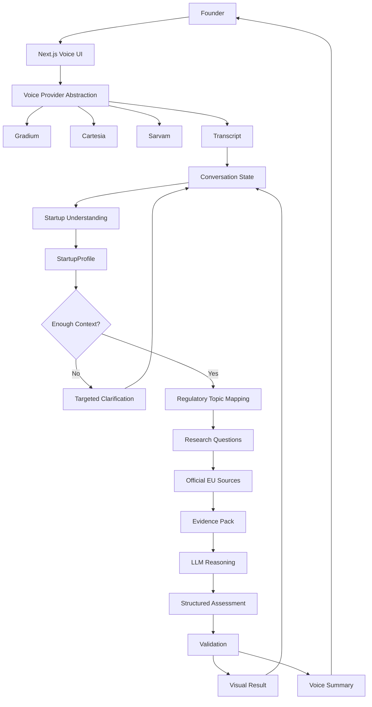

# 🇪🇺 CanIShipEU

### Can you ship this in Europe? Just ask.

**CanIShipEU** is a voice-first regulatory research assistant for startup founders.

Describe what you're building in your own words. CanIShipEU turns that description into a structured startup profile, identifies the regulatory questions that actually matter, researches authoritative EU sources, and explains the result in plain language — including an **EU vs US comparison**.

> **Your startup idea. EU reality. One conversation.**

---

## Why CanIShipEU?

Founders don't usually wake up thinking:

> "I need to determine whether my AI system falls under a particular regulatory classification."

They think:

> "I'm building an AI recruiter. Can I launch it in Germany?"

or:

> "We're building an AI medical assistant. What do we need before launching in Europe?"

The problem isn't simply finding regulations.

The problem is figuring out **which regulations are relevant to the specific product being built**.

CanIShipEU is designed around that problem.

### Product philosophy

> **Don't ask the founder to understand regulation. Understand the founder's product first.**

Instead of forcing founders through a regulatory questionnaire, CanIShipEU starts with a natural conversation.

The system progressively turns that conversation into the context required for meaningful regulatory research.

---

# 🎙️ The Core Experience

A founder can simply say:

> "I'm building an AI recruitment platform that reads CVs, scores candidates and recommends who should get interviewed. We're planning to launch in France next year."

CanIShipEU might ask:

> "Does the AI make the final hiring decision, or does a human make the final decision?"

The founder answers:

> "A human makes the final decision."

CanIShipEU then uses that additional context to determine what should actually be researched.

The result is not just an AI-generated paragraph.

It is a structured investigation:

```text
Founder
   ↓
Natural language description
   ↓
Understand the startup
   ↓
Build StartupProfile
   ↓
Identify missing information
   ↓
Ask targeted clarification questions
   ↓
Map relevant regulatory topics
   ↓
Generate research questions
   ↓
Retrieve authoritative sources
   ↓
Extract evidence
   ↓
Reason over evidence
   ↓
Validate structured assessment
   ↓
Explain the result
   ↓
Continue the conversation
```

---

# 🧠 What Makes It Different?

A generic AI regulatory assistant looks like:

```text
Question
   ↓
LLM
   ↓
Answer
```

CanIShipEU is designed as an investigation workflow:

```text
Founder
   ↓
Understand
   ↓
StartupProfile
   ↓
Clarify
   ↓
Regulatory Mapping
   ↓
Research Questions
   ↓
Evidence
   ↓
Reason
   ↓
Validate
   ↓
Assessment
   ↓
Explain
   ↓
Follow-up
```

The goal isn't to build a model that is "smarter than ChatGPT."

The goal is to build a better **product workflow around the model**.

> **Don't build an AI that answers regulatory questions. Build an AI that figures out which regulatory questions a founder needs answered.**

---

# 👤 Who Is It For?

CanIShipEU is primarily designed for:

* Startup founders
* Indie hackers
* Product teams
* AI startups
* Pre-launch companies
* Developers building products for the EU market

Especially founders who are asking:

> "Can I actually launch this in Europe?"

---

# 🎯 Initial Use Cases

The prototype intentionally focuses on a limited set of scenarios rather than attempting to cover every EU regulation.

Initial scenarios include:

* 🤖 AI recruitment
* 🏥 Medical / health AI
* 👁️ Biometrics
* 📹 Surveillance systems
* 💳 Credit and financial decision systems
* 🎓 Education AI
* ✍️ Content-generation systems
* 🏭 Industrial / computer vision systems

The regulatory coverage can expand later as the research layer becomes more mature.

---

# 🧩 Startup Understanding

Before researching regulation, CanIShipEU creates a structured representation of the startup.

Example:

```ts
type StartupProfile = {
  product: string;
  domain?: string;
  aiCapability?: string;
  users?: string[];
  affectedPeople?: string[];
  decisionRole?:
    | "none"
    | "assistance"
    | "recommendation"
    | "decision"
    | "unknown";
  humanInvolvement?: boolean | "unknown";
  usesPersonalData?: boolean | "unknown";
  usesSensitiveData?: boolean | "unknown";
  usesBiometrics?: boolean | "unknown";
  geography?: string[];
  plannedLaunch?: string;
  additionalContext?: string;
};
```

Example:

```json
{
  "product": "AI recruitment platform",
  "domain": "employment",
  "ai_capability": "candidate scoring and recommendation",
  "users": ["employers", "recruiters"],
  "affected_people": ["job applicants"],
  "decision_role": "recommendation",
  "human_involvement": true,
  "uses_personal_data": true,
  "uses_sensitive_data": "unknown",
  "uses_biometrics": false,
  "geography": ["France", "European Union"],
  "planned_launch": "2027"
}
```

This structured representation becomes the foundation for the rest of the investigation.

---

# ❓ Targeted Clarification

CanIShipEU does not ask founders to complete a giant regulatory questionnaire.

Instead, it asks questions only when the answer could materially change the assessment.

Examples:

* Does the AI make the final decision?
* Does a human review the AI's output?
* Does the system process personal data?
* Does it process sensitive data?
* Does it use biometric information?
* Who is affected by the system?
* Which countries are you launching in?
* When are you planning to launch?

This creates a conversational experience rather than a form-filling experience.

---

# ⚖️ Regulatory Mapping

The system combines deterministic rules with LLM reasoning to identify relevant regulatory areas.

For example:

```text
IF domain = employment
AND AI capability = candidate evaluation
→ flag employment-related AI research

IF usesBiometrics = true
→ flag biometric AI research

IF geography includes EU
→ include EU regulatory framework

IF plannedLaunch is in the future
→ consider rules applicable by launch date
```

The exact mapping rules can evolve as regulatory frameworks and guidance change.

The important architectural principle is:

> **Use deterministic logic where the decision can be explicit. Use the LLM where interpretation is required.**

---

# 🔎 Research Engine

CanIShipEU does not treat the LLM as the legal authority.

The research layer prioritizes authoritative sources.

### Source hierarchy

**Tier 1 — Primary / authoritative**

* European Commission
* EUR-Lex
* Official EU institutions
* Official EU regulatory guidance

**Tier 2 — National sources**

* National regulators
* Government agencies
* Official national guidance

**Tier 3 — Secondary analysis**

* Reputable legal analysis
* Regulatory commentary
* Industry guidance

Secondary sources can provide context, but the assessment should prioritize primary sources whenever possible.

---

# 📚 Evidence-First Reasoning

Instead of giving the model a vague instruction like:

> "Tell me whether this startup is legal."

CanIShipEU builds an evidence package.

Conceptually:

```text
Research Question
       ↓
Source
       ↓
Relevant Section
       ↓
Evidence / Fact
       ↓
What the Evidence Supports
```

The assessment layer then reasons over the collected evidence.

This makes the system easier to inspect, debug and improve.

---

# 🟢 🟡 🔴 Assessment

The system produces a structured assessment rather than a single conversational answer.

```ts
type Assessment = {
  verdict: "GREEN" | "YELLOW" | "RED";
  confidence: "low" | "medium" | "high";
  summary: string;
  why: string[];
  relevantRegulations: string[];
  requirements: string[];
  importantDates: {
    date: string;
    description: string;
  }[];
  euVsUs: {
    eu: string;
    us: string;
  };
  uncertainties: string[];
  sources: {
    title: string;
    url: string;
  }[];
};
```

### Verdict semantics

**🟢 GREEN**

No major regulatory obstacle was identified from the sources reviewed.

This does **not** mean the product is guaranteed to be legally compliant.

**🟡 YELLOW**

The product may be launchable, but meaningful regulatory requirements, dependencies or uncertainty need attention.

**🔴 RED**

A significant restriction, prohibition or serious regulatory obstacle appears relevant based on the evidence reviewed.

The system should never claim:

> "Definitely legal."

or:

> "Definitely illegal."

Instead, it should clearly communicate **what was found, why it matters, and what remains uncertain**.

---

# 🇪🇺 EU vs 🇺🇸 US

Founders often aren't asking only:

> "What does Europe require?"

They're asking:

> "Should we launch in Europe or the US first?"

CanIShipEU therefore includes an EU vs US comparison as part of the assessment.

Example:

```text
EU 🇪🇺
Higher regulatory requirements
Relevant AI obligations
Data protection considerations
Human oversight requirements
Documentation / transparency considerations

US 🇺🇸
Different federal/state framework
Different sector-specific requirements
Different compliance considerations
Potentially different launch path
```

The comparison is designed to provide **decision context**, not to pretend that "the US" or "Europe" has one single universal rule.

---

# 🎙️ Voice Is the Interface

Voice isn't just a microphone attached to a chatbot.

It is the primary interaction model.

The founder should be able to explain their startup the same way they would explain it to another founder.

```text
Founder
   ↓
Microphone
   ↓
Speech-to-Text
   ↓
Conversation State
   ↓
Startup Understanding
   ↓
Regulatory Research
   ↓
Assessment
   ↓
Response Text
   ↓
Text-to-Speech
   ↓
Founder
```

The screen provides the detailed evidence and assessment.

The voice provides the concise explanation.

This keeps the interaction conversational without hiding the underlying research.

---

# 🔊 Voice Provider Architecture

CanIShipEU uses a provider abstraction rather than tightly coupling the product to one voice API.

```ts
type VoiceProvider = {
  transcribe(audio: Buffer): Promise<string>;
  synthesize(
    text: string,
    options?: VoiceOptions
  ): Promise<Buffer>;
};
```

The architecture supports:

```ts
type VoiceProviderName =
  | "gradium"
  | "cartesia"
  | "sarvam";
```

### Primary voice stack

**Gradium** is the primary voice provider for the prototype.

It is the default path for the main demo and allows the project to showcase the voice-first experience without making the product dependent on a single implementation detail.

### Cartesia

Cartesia is supported as an optional provider adapter for:

* Voice experiments
* Latency / quality comparison
* Alternative TTS paths
* Future fallback strategies

It does not need to be used simultaneously with Gradium for every request.

### Sarvam

Sarvam is an optional multilingual provider adapter.

Its role is to explore multilingual voice interaction — particularly useful for demonstrating that the underlying product can support founders communicating in languages beyond the initial English-first experience.

Again, it is an adapter rather than a requirement for the core pipeline.

### Why not use all three simultaneously?

Because that would turn the product into an API showcase.

The architecture should instead be:

```text
                 VoiceProvider
                      │
        ┌─────────────┼─────────────┐
        ↓             ↓             ↓
    Gradium        Cartesia      Sarvam
    Primary        Optional      Optional
```

The product remains the focus.

The providers become interchangeable infrastructure.

---

# 🗣️ Conversation State

The assistant maintains a lightweight conversation history.

```ts
type ConversationMessage = {
  role: "user" | "assistant";
  content: string;
};
```

The conversation can move through states such as:

```text
Idle
 ↓
Listening
 ↓
Transcribing
 ↓
Thinking
 ↓
Researching
 ↓
Speaking
 ↓
Waiting
```

This allows the user to:

* Clarify their startup
* Correct assumptions
* Ask follow-up questions
* Change launch geography
* Challenge the assessment
* Explore "what if" scenarios

Example:

> "What if we remove the automated candidate ranking?"

The system should be able to update the relevant startup context and reassess the situation.

---

# 🏗️ Architecture



---

# 🧠 LLM Architecture

The LLM is used for tasks where natural-language understanding and reasoning are valuable.

Examples:

* Understanding startup descriptions
* Extracting structured startup context
* Identifying missing information
* Generating targeted research questions
* Reasoning over collected evidence
* Explaining results in natural language

The LLM is **not** treated as the source of truth for regulations.

Conceptually:

```ts
const result = await llm.analyze({
  startupProfile,
  sources
});
```

The provider can be changed without rewriting the product architecture.

---

# 💰 Cost Strategy

The prototype is designed around a **$0-first development strategy**.

The goal is to use available free tiers / credits efficiently while avoiding unnecessary infrastructure.

### Planned approach

**Voice**

* Gradium — primary
* Cartesia — optional
* Sarvam — optional

**LLM**

* OpenRouter free models where appropriate
* Groq free tier as a fallback / alternative

**Research**

* Curated authoritative EU sources
* Lightweight targeted retrieval

**Infrastructure**

* Next.js API routes
* Local development first
* Optional Vercel deployment later

The prototype does not depend on a paid Gemini plan.

Free-tier availability and provider limits can change, so the implementation should not assume unlimited free inference.

---

# 🗂️ Project Structure

```text
canishipeu/
│
├── app/
│   ├── page.tsx
│   └── api/
│       ├── transcribe/
│       │   └── route.ts
│       ├── understand/
│       │   └── route.ts
│       ├── research/
│       │   └── route.ts
│       ├── assess/
│       │   └── route.ts
│       └── speak/
│           └── route.ts
│
├── components/
│   ├── VoiceInterface.tsx
│   ├── Conversation.tsx
│   ├── StartupProfile.tsx
│   ├── VerdictCard.tsx
│   ├── Assessment.tsx
│   ├── EUUSComparison.tsx
│   └── Sources.tsx
│
├── lib/
│   ├── gradium.ts
│   ├── cartesia.ts
│   ├── sarvam.ts
│   ├── voice.ts
│   ├── llm.ts
│   ├── research.ts
│   ├── regulations.ts
│   ├── prompts.ts
│   └── validation.ts
│
├── data/
│   └── eu-sources.json
│
├── types/
│   ├── startup.ts
│   ├── assessment.ts
│   └── voice.ts
│
├── public/
│
├── .env.local
├── package.json
├── tsconfig.json
└── README.md
```

---

# 🔌 API Routes

### `POST /api/transcribe`

Converts recorded audio into text through the selected STT provider.

```text
Audio
 ↓
Voice Provider
 ↓
Transcript
```

---

### `POST /api/understand`

Turns conversation context into a structured `StartupProfile`.

```text
Conversation
 ↓
LLM
 ↓
StartupProfile
```

---

### `POST /api/research`

Determines relevant regulatory topics, generates research questions and retrieves supporting sources.

```text
StartupProfile
 ↓
Regulatory Mapping
 ↓
Research Questions
 ↓
Sources
 ↓
Evidence Pack
```

---

### `POST /api/assess`

Reasons over the startup profile and collected evidence to generate a structured assessment.

```text
StartupProfile + Evidence
 ↓
LLM
 ↓
Assessment
 ↓
Validation
```

---

### `POST /api/speak`

Converts the assistant's response into speech using the selected TTS provider.

```text
Response Text
 ↓
Voice Provider
 ↓
Audio
```

---

# 🖥️ Interface

## Homepage

The initial interface is intentionally minimal.

```text
CAN I SHIP THIS
IN EUROPE?

Tell us what you're building.

🎙️
Start talking

or type instead

🇪🇺 EU     🇺🇸 US

No legal jargon required.

Prototype / informational tool. Not legal advice.
```

Possible positioning line:

> **Tell me what you're building. I'll check the EU vs US reality.**

---

# 📊 Result Interface

The detailed result should look roughly like:

```text
┌────────────────────────────────────────┐
│        CAN I SHIP THIS?                │
│                                        │
│               🟡                       │
│             YELLOW                     │
│                                        │
│ Potentially launchable, but meaningful │
│ requirements need attention.           │
└────────────────────────────────────────┘

WHY

• Employment-related AI
• Candidate evaluation
• Personal data
• EU deployment


WHAT TO INVESTIGATE

✓ AI classification
✓ Human oversight
✓ Documentation
✓ Transparency
✓ Data protection


IMPORTANT DATES

...


EU 🇪🇺                  US 🇺🇸

...                     ...


SOURCES

...
```

The interface should make the **reasoning visible without overwhelming the founder**.

---

# 🧪 Example

### Founder

> "I'm building an AI recruiter that reads CVs, scores candidates and recommends who should get interviewed. We're planning to launch in Germany next year."

### CanIShipEU

> "Does the AI make the final hiring decision, or does a human make the final decision?"

### Founder

> "A human makes the final decision."

### System

The system then investigates the relevant regulatory questions, gathers evidence and produces a structured assessment.

The result might identify areas such as:

```text
🟡 YELLOW

Relevant areas:
• Employment-related AI
• Candidate evaluation
• Personal data
• Human oversight
• EU deployment

Requires investigation:
• AI classification
• Applicable obligations
• Transparency
• Documentation
• Human oversight
• Data protection

EU vs US:
Different regulatory considerations apply.

Sources:
Primary EU / national sources used for the assessment.
```

The exact verdict should always depend on the evidence retrieved for the specific scenario.

---

# 🛡️ Safety & Reliability Principles

CanIShipEU is an **informational research prototype**, not a law firm or legal advice service.

The system should:

* Prefer authoritative sources
* Show supporting sources
* Separate evidence from interpretation
* Communicate uncertainty
* Avoid inventing regulations
* Avoid inventing legal dates
* Avoid unsupported legal conclusions
* Validate structured LLM output
* Clearly distinguish facts from assumptions
* Encourage professional legal review for consequential decisions

Every assessment should display:

> **Prototype / informational tool — not legal advice.**

---

# 🚫 Deliberate Scope Limits

CanIShipEU is intentionally **not** trying to become a complete EU legal platform.

The prototype does not include:

* ❌ User accounts
* ❌ Authentication
* ❌ Payments
* ❌ Database
* ❌ Admin dashboard
* ❌ Mobile app
* ❌ Browser extension
* ❌ PDF upload
* ❌ Full website crawling
* ❌ Complete EU law database
* ❌ Large-scale vector database
* ❌ LangChain / LlamaIndex dependency
* ❌ Microservices
* ❌ Production monitoring
* ❌ Public unlimited API
* ❌ Voice cloning as a core feature
* ❌ Full multilingual expansion

The objective is to demonstrate the **core product loop extremely well**.

---

# 🚀 Future Possibilities

If the core concept proves useful, CanIShipEU could evolve into:

### Regulatory monitoring

> "Tell me when the rules affecting my startup change."

### Founder compliance workspace

Track:

* Requirements
* Evidence
* Open questions
* Important dates
* Regulatory changes

### More jurisdictions

Expand beyond:

```text
EU 🇪🇺
US 🇺🇸
```

into additional markets.

### Multilingual founder conversations

Allow founders to explain products in more languages while preserving the same structured regulatory workflow.

### Voice provider benchmarking

Expose an internal developer mode for comparing:

```text
Gradium
Cartesia
Sarvam
```

across latency, transcription quality and speech generation.

### Deeper regulatory domains

Gradually expand the scenario library as the evidence and validation layer becomes more reliable.

---

# 🧭 Product Principle

CanIShipEU is not fundamentally a voice app.

It is not fundamentally a chatbot.

It is not fundamentally a search engine.

It is a **startup-aware regulatory investigation system with voice as the interface**.

The key loop is:

```text
Understand the founder
        ↓
Understand the product
        ↓
Understand the context
        ↓
Find the relevant questions
        ↓
Find the relevant evidence
        ↓
Reason over the evidence
        ↓
Explain the implications
```

Voice simply makes that interaction feel natural.

---

# 🎯 MVP Success Criteria

The prototype is successful if a founder can say:

> "I'm building an AI recruitment platform in France. It scores candidates and recommends who should be interviewed. Humans make the final decision."

…and the system can:

1. Understand the product.
2. Identify the employment context.
3. Identify candidate evaluation as relevant.
4. Understand the role of human decision-making.
5. Ask useful clarification questions.
6. Identify relevant regulatory topics.
7. Research authoritative sources.
8. Produce a structured evidence-backed assessment.
9. Explain a GREEN / YELLOW / RED result.
10. Show why the result was reached.
11. Show supporting sources.
12. Compare relevant EU and US considerations.
13. Explain the result through voice.
14. Continue the conversation with follow-up questions.
15. Reassess when important assumptions change.

---

# 📣 Demo Positioning

The product should be demonstrated through the founder's question rather than through a technical feature checklist.

### The hook

> **Can I ship this in Europe?**

### The interaction

> "Just tell me what you're building."

### The reveal

The system doesn't immediately answer.

It **understands first**.

Then it asks the one or two questions that actually matter.

Then it researches.

Then it explains.

That progression is the product.

---

# 🎥 Demo Story

A short demo can follow this narrative:

```text
Founder has an idea
        ↓
"Can I ship this in Europe?"
        ↓
Founder talks naturally
        ↓
AI understands the startup
        ↓
AI asks a smart clarification
        ↓
Research begins
        ↓
Evidence appears
        ↓
GREEN / YELLOW / RED
        ↓
Why?
        ↓
EU vs US
        ↓
Founder asks a follow-up
        ↓
Voice answers
```

The demo should make the audience think:

> **"I would actually use that before launching my startup."**

---

# 🌍 The Bigger Idea

Europe doesn't have a shortage of regulations.

Founders have a shortage of **clarity**.

CanIShipEU explores whether AI can sit between:

```text
Complex regulation
        +
Messy startup context
        ↓
Clear founder decision
```

The long-term opportunity is not simply:

> "Ask AI about regulation."

It is:

> **"Tell AI what you're building, and let it figure out what you need to know before you ship."**

---

# 🛠️ Tech Stack

| Layer                       | Technology                                  |
| --------------------------- | ------------------------------------------- |
| Framework                   | Next.js                                     |
| Language                    | TypeScript                                  |
| UI                          | Tailwind CSS                                |
| Components                  | shadcn/ui                                   |
| Primary Voice               | Gradium                                     |
| Optional Voice              | Cartesia                                    |
| Optional Multilingual Voice | Sarvam                                      |
| LLM                         | OpenRouter / Groq                           |
| Research                    | Official EU sources + lightweight retrieval |
| Backend                     | Next.js API Routes                          |
| Database                    | None initially                              |
| Deployment                  | Local first / optional Vercel               |

---

# ⚙️ Environment Variables

Create `.env.local`:

```env
GRADIUM_API_KEY=
CARTESIA_API_KEY=
SARVAM_API_KEY=

OPENROUTER_API_KEY=
GROQ_API_KEY=
```

The application should use provider abstractions so individual providers can be enabled or disabled without changing the core product logic.

For example:

```env
VOICE_PROVIDER=gradium
```

The primary demo path should work with Gradium before optional provider integrations are added.

---

# 🚀 Getting Started

## 1. Clone the repository

```bash
git clone <your-repository-url>
cd canishipeu
```

## 2. Install dependencies

```bash
npm install
```

## 3. Configure environment variables

Create:

```text
.env.local
```

and add the required API keys.

## 4. Start the development server

```bash
npm run dev
```

Open:

```text
http://localhost:3000
```

---

# 🔬 Development Philosophy

CanIShipEU follows a few simple engineering principles:

### Keep the workflow explicit

Prefer understandable pipelines over framework-heavy abstractions.

### Use the LLM where it adds value

Natural language understanding and reasoning belong with the model.

Deterministic decisions should remain deterministic where possible.

### Evidence before conclusions

Regulatory conclusions should be grounded in retrieved sources.

### Provider abstraction

Voice and LLM providers should be replaceable.

### Structured outputs

Important model outputs should be validated before reaching the UI.

### Small infrastructure

A prototype should not need a distributed architecture to demonstrate a good product idea.

---

# 📌 Disclaimer

**CanIShipEU is a prototype for informational and research purposes only. It does not provide legal advice, legal opinions, or guarantees of regulatory compliance.**

Regulatory requirements can depend on the exact product, implementation, jurisdiction, sector, data practices, deployment model and applicable dates.

Always verify important conclusions against current official sources and seek qualified legal advice where appropriate.

---

# ⭐ The One-Liner

> **CanIShipEU is a voice-first AI assistant that helps startup founders understand whether and how they can launch their products in Europe.**

---

## Built around one question:

# 🇪🇺 Can I ship this in Europe?

**Just ask.**
