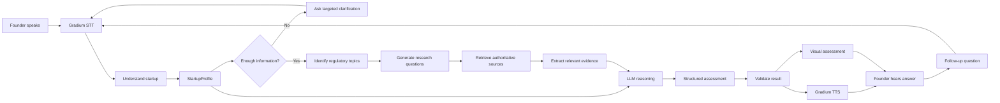
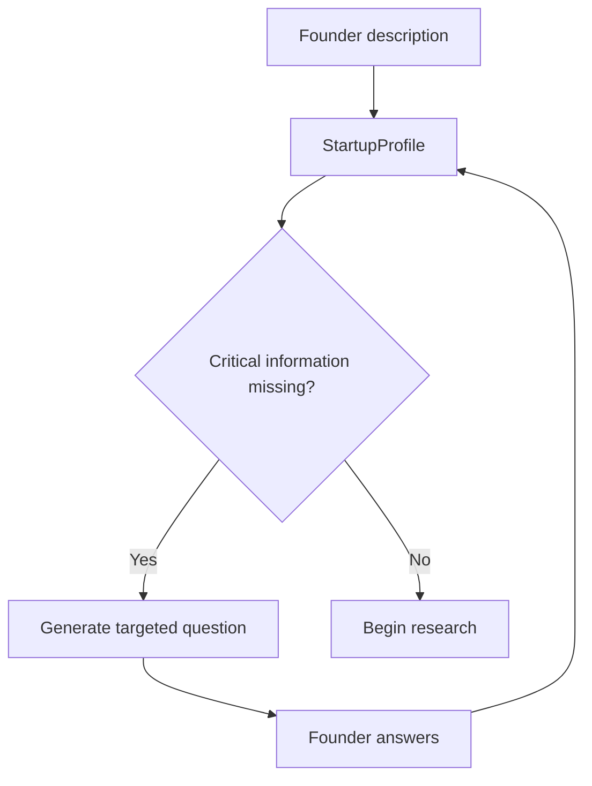
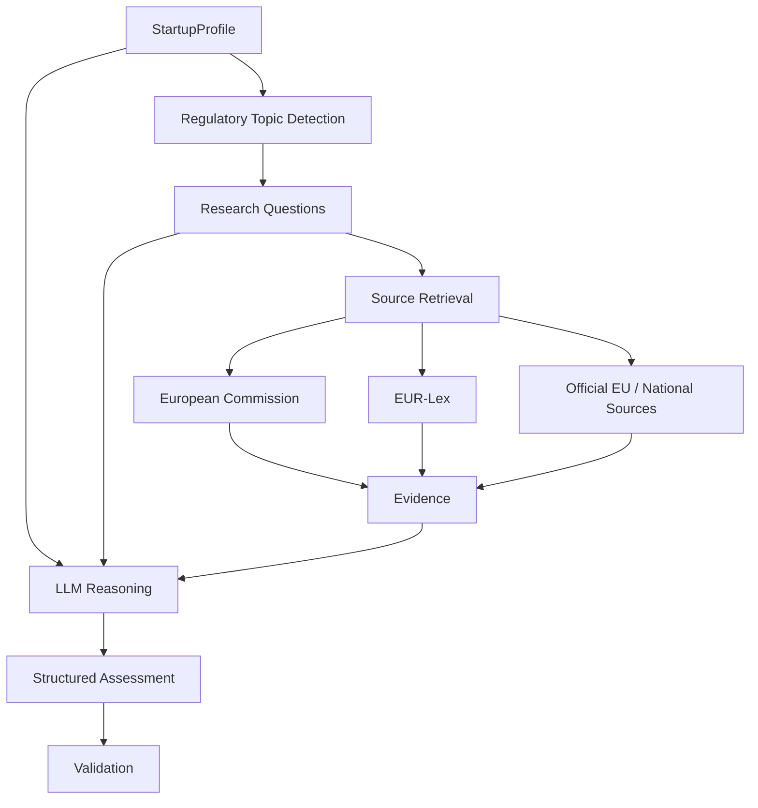
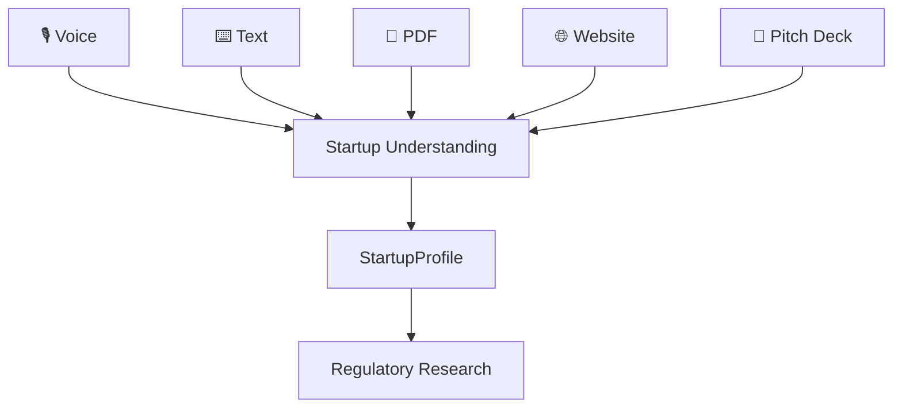
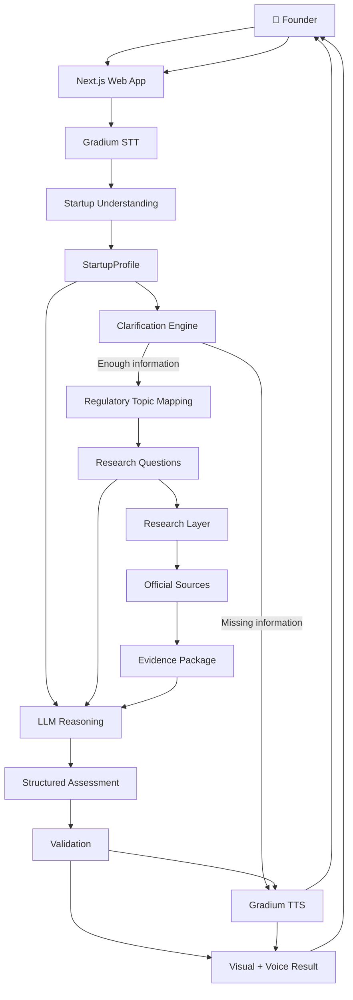
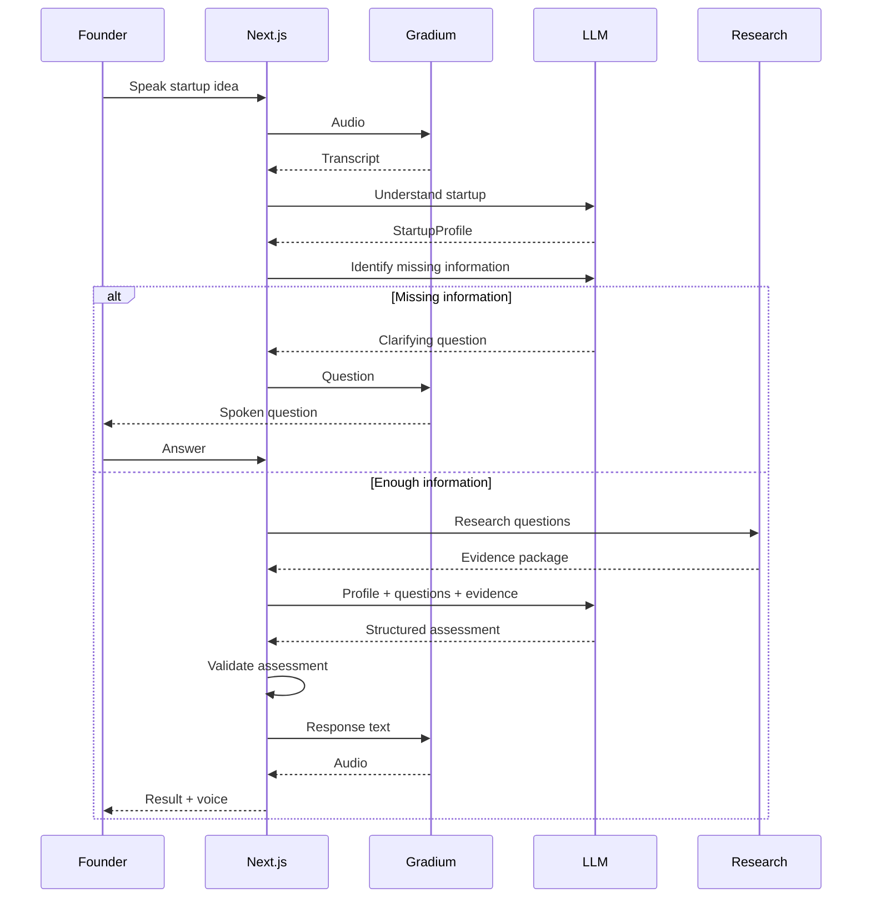

# CanIShipEU 🇪🇺

> **Can you ship this in Europe? Just ask.**

CanIShipEU is a **voice-first regulatory research assistant for startup founders**.

A founder describes what they are building in natural language. CanIShipEU first tries to understand the startup, identifies information that is missing, asks targeted follow-up questions, determines which regulatory topics are relevant, researches authoritative EU sources, reasons over the retrieved evidence, and produces a structured pre-launch assessment.

The founder can then continue the conversation and ask questions such as:

> “Why did you classify us as yellow?”

> “What if we launch in the US instead?”

> “What changes if a human makes the final decision?”

The goal is **not** to replace lawyers or provide guaranteed legal advice.

The goal is to make the first regulatory investigation much easier for a founder:

> **“I'm building this product. What do I need to know before I launch it in Europe?”**

---

# The Core Idea

CanIShipEU is **not** intended to be “ChatGPT Voice + Google search.”

General-purpose AI assistants can already understand speech, search the web, and answer regulatory questions.

The product therefore needs to do something more specific.

A generic AI experience looks roughly like:

```text
Founder question
      ↓
General-purpose AI
      ↓
Answer
```

CanIShipEU is designed as a structured investigation workflow:

```text
Founder speaks
      ↓
Understand the startup
      ↓
Create StartupProfile
      ↓
Identify missing information
      ↓
Ask targeted questions
      ↓
Map regulatory topics
      ↓
Generate research questions
      ↓
Retrieve authoritative evidence
      ↓
Reason over evidence
      ↓
Validate assessment
      ↓
Generate structured result
      ↓
Explain by voice
      ↓
Founder asks follow-up questions
```

The important product is therefore not simply the LLM.

The product is the **workflow surrounding the LLM**.

---

# The Problem

European startup founders often have a simple question:

> **“Can I launch this in Europe?”**

Getting a useful answer can be difficult because the information needed to answer that question may be spread across:

* European Commission websites
* EUR-Lex
* EU regulations
* official guidance
* implementation timelines
* national authorities
* technical requirements
* legal interpretations

The problem is not necessarily that the information does not exist.

The problem is that founders describe products in **startup language**, while regulations describe situations in **regulatory language**.

A founder might say:

> “We're building an AI system that ranks job candidates.”

The relevant regulatory concepts might involve:

* employment
* candidate evaluation
* AI system classification
* provider/deployer responsibilities
* human oversight
* documentation
* transparency
* personal data
* potentially sensitive data
* implementation dates

A founder should not need to know all of those concepts before asking the question.

**CanIShipEU's job is to bridge that gap.**

---

# Who Is It For?

The primary user is:

> **A startup founder who wants to understand the regulatory considerations around launching a product in Europe.**

The prototype is particularly suited to areas where regulation can be especially relevant, such as:

* AI recruitment
* medical/health AI
* biometrics
* surveillance
* credit/financial decision systems
* education AI
* content-generation systems
* industrial/computer-vision systems
* other AI products with significant real-world impact

The initial version should intentionally support a limited set of scenarios rather than pretending to cover every EU law and every industry.

---

# What We Are Building

The founder should be able to start with something as simple as:

> “I'm building an AI recruiter that reads CVs, scores candidates and recommends who should get interviewed. We're planning to launch in Germany next year.”

CanIShipEU should **not immediately answer**.

Instead, it should determine whether important information is missing.

For example:

> “Does the AI make the final hiring decision, or does a human make the final decision?”

The founder answers:

> “A human makes the final decision.”

The system now has a more complete understanding of the product.

It can then research the relevant regulatory topics and produce an assessment.

For example:

> 🟡 **YELLOW**
>
> Your product may be deployable in the EU, but employment-related AI can involve significant regulatory requirements.
>
> The main areas you should investigate are...

The system should explain **why** it reached that assessment and show the evidence behind the relevant conclusions.

---

# Product Philosophy

The core principle is:

> **Don't ask the founder to understand regulation. Understand the founder's product first.**

A founder should not need to know:

> “Which article should I search?”

They should be able to say:

> “Here's what we're building.”

CanIShipEU figures out:

> “What do I need to know about this product before I can meaningfully assess it?”

---

# Why This Is Different From a Generic AI Chatbot

CanIShipEU does not claim that its underlying LLM is smarter than ChatGPT, Gemini, Claude, or another general-purpose model.

The differentiation is in the **system design**.

A generic AI can potentially answer:

> “Is AI recruitment regulated in Europe?”

CanIShipEU attempts to conduct a more structured investigation:

```text
Startup
   ↓
Structured startup profile
   ↓
Regulatory classification
   ↓
Targeted questions
   ↓
Targeted research
   ↓
Relevant evidence
   ↓
Evidence-backed reasoning
   ↓
Structured assessment
```

This means the founder does not have to know which questions to ask.

The system is responsible for constructing the investigation.

---

# Why Voice Matters

Voice is not simply a microphone placed in front of a chatbot.

Voice is one of the main interaction mechanisms of the product.

Instead of asking a founder to fill out a regulatory questionnaire:

```text
Industry:
AI capability:
Users:
Affected people:
Personal data:
Sensitive data:
Countries:
Launch date:
Human oversight:
...
```

the founder can simply talk.

For example:

```text
Founder:

"I'm building an AI tool for hospitals
that analyzes medical images."

Agent:

"Is the system helping doctors diagnose patients,
or is it mainly organizing medical images?"

Founder:

"It helps doctors identify possible tumors."

Agent:

"Which EU countries are you planning to launch in?"

Founder:

"Germany and France."

Agent:

"Got it. I have enough information to
research the relevant requirements."
```

The voice interface therefore acts as a **natural interview layer**.

This is also where Gradium becomes an important part of the technical demonstration.

The prototype can showcase:

* speech-to-text
* text-to-speech
* natural conversational interaction
* multilingual interaction where supported
* responsive voice feedback
* potentially interruption/turn-taking
* optional voice cloning as a future demonstration

---

# The Core User Flow

The complete experience is:

```text
Listen
   ↓
Understand
   ↓
Clarify
   ↓
Research
   ↓
Reason
   ↓
Validate
   ↓
Explain
   ↓
Continue conversation
```

More specifically:



---

# Startup Understanding

This is one of the most important components.

The founder's natural language should first be converted into a structured internal representation.

For example:

```text
Founder:

"I'm building an AI recruiter that reads CVs,
scores candidates and recommends who should be
interviewed. A human makes the final decision.
We're launching in Germany."
```

The understanding layer could produce:

```json
{
  "product": "AI recruitment platform",
  "domain": "employment",
  "ai_capability": "candidate scoring and recommendation",
  "users": [
    "employers",
    "recruiters"
  ],
  "affected_people": [
    "job applicants"
  ],
  "decision_role": "recommendation",
  "human_involvement": true,
  "uses_personal_data": true,
  "uses_sensitive_data": "unknown",
  "uses_biometrics": false,
  "geography": [
    "Germany",
    "European Union"
  ],
  "planned_launch": "2027"
}
```

This object is called:

```text
StartupProfile
```

It becomes the central representation used throughout the system.

---

# StartupProfile

The initial TypeScript model:

```typescript
type StartupProfile = {
  product: string;

  domain?: string;

  aiCapability?: string;

  users?: string[];

  affectedPeople?: string[];

  decisionRole?:
    | "none"
    | "assistance"
    | "recommendation"
    | "decision"
    | "unknown";

  humanInvolvement?: boolean | "unknown";

  usesPersonalData?: boolean | "unknown";

  usesSensitiveData?: boolean | "unknown";

  usesBiometrics?: boolean | "unknown";

  geography?: string[];

  plannedLaunch?: string;

  additionalContext?: string;
};
```

Everything else in the application consumes this object.

---

# Why Structured Understanding Matters

Consider two founders.

### Founder A

> “We built a chatbot that helps people understand their CV.”

### Founder B

> “We built an AI that ranks applicants and automatically rejects candidates.”

Both might casually describe their product as:

> “an AI recruiting tool.”

But the regulatory investigation may be very different.

This is why the system must understand the **actual function of the product**, not just its marketing description.

---

# Clarification Engine

Founders will often provide incomplete information.

The system should identify missing information that could materially change the assessment.

For example:



Possible questions include:

* Does the AI make the final decision?
* Does a human review the AI output?
* Are you processing personal data?
* Are you processing sensitive data?
* Are you using biometric information?
* Who is affected by the system?
* Which countries are you launching in?
* When are you planning to launch?

The system should **not ask every possible question**.

It should ask only questions relevant to the startup and questions whose answers could materially change the investigation.

---

# Regulatory Mapping

Once we have a sufficiently complete `StartupProfile`, the system determines:

> **Which regulatory topics should we investigate?**

For example:

```text
StartupProfile
      ↓
Employment AI
      ↓
Candidate evaluation
      ↓
Potential AI Act relevance
      ↓
Human oversight
      ↓
Transparency
      ↓
Data protection
      ↓
Implementation timeline
```

This step is important because it prevents the LLM from simply receiving a generic prompt such as:

> “Tell me everything about EU law.”

Instead, the system creates a targeted research plan.

---

# Regulatory Question Generation

The system should turn the startup into specific research questions.

For the AI recruiting example:

```text
1. Is this use case covered by relevant EU AI rules?

2. Does candidate evaluation or ranking fall into
   a regulated/high-risk category?

3. What obligations may apply?

4. Does the role of human decision-makers affect
   the assessment?

5. What transparency requirements are relevant?

6. What documentation or oversight requirements
   may apply?

7. What data protection considerations are relevant?

8. Which requirements apply by the planned launch date?

9. Are there France/Germany-specific considerations?
```

The exact questions depend on the startup.

This is the beginning of the project's **regulatory investigation engine**.

---

# Research Layer

The LLM should not be treated as the authoritative source of EU law.

Instead:

```text
StartupProfile
      ↓
Regulatory topics
      ↓
Research questions
      ↓
Authoritative sources
      ↓
Evidence
      ↓
LLM reasoning
```

The research layer should prioritize:

### Tier 1 — Primary / official sources

* European Commission
* EUR-Lex
* official EU institutions
* official EU guidance
* official national authorities where relevant

### Tier 2 — Government / regulator sources

Relevant national regulators and government guidance.

### Tier 3 — Secondary analysis

Reputable legal or regulatory analysis where useful for context.

Secondary sources should not automatically override primary sources.

---

# Evidence Extraction

The system should not simply collect search-result links and dump everything into the LLM.

The research layer should construct an evidence package.

Conceptually:

```text
Question
    ↓
Source
    ↓
Relevant section
    ↓
Relevant fact / passage
    ↓
What this evidence supports
```

For example:

```text
QUESTION

Does this type of employment AI fall into
a regulated/high-risk category?

SOURCE

Official EU source

RELEVANT EVIDENCE

Relevant provision / guidance

SUPPORTS

Potential classification assessment
```

The purpose is to make the reasoning process more traceable.

---

# Research and Reasoning Architecture



The LLM's job is therefore:

> **Understand the startup → interpret the retrieved evidence → produce an assessment**

rather than:

> **Remember all applicable law → search from memory → make a confident claim**

---

# Deterministic Rules + LLM

Not every part of the system needs to be handled by an LLM.

Some obvious mappings can be implemented as application logic.

For example:

```text
IF
domain = employment
AND
AI capability = candidate evaluation

THEN
flag employment-AI research
```

Or:

```text
IF
usesBiometrics = true

THEN
flag biometric AI research
```

Or:

```text
IF
geography includes EU

THEN
include EU regulatory framework
```

Or:

```text
IF
planned launch is in the future

THEN
check which rules are applicable
by the planned launch date
```

The exact rules will evolve.

The important architecture is:

```text
Deterministic logic
        +
LLM classification/reasoning
        +
Authoritative evidence
```

This reduces unnecessary dependence on model guesses.

---

# LLM Reasoning

The assessment model should receive:

```text
STARTUP PROFILE
        +
RESEARCH QUESTIONS
        +
RETRIEVED EVIDENCE
```

The model should be instructed to:

* reason from supplied evidence
* avoid inventing regulations
* distinguish fact from interpretation
* disclose uncertainty
* avoid unsupported legal conclusions
* associate important claims with sources
* produce structured output

Conceptually:

```typescript
const assessment = await llm.analyze({
  startupProfile,
  researchQuestions,
  evidence
});
```

---

# Structured Assessment

The model should not return an arbitrary block of prose.

The initial assessment structure can look like:

```typescript
type Assessment = {
  verdict: "GREEN" | "YELLOW" | "RED";

  confidence: "low" | "medium" | "high";

  summary: string;

  why: string[];

  relevantRegulations: string[];

  requirements: string[];

  importantDates: {
    date: string;
    description: string;
  }[];

  euVsUs: {
    eu: string;
    us: string;
  };

  uncertainties: string[];

  sources: {
    title: string;
    url: string;
  }[];
};
```

The frontend turns this into the result interface.

---

# GREEN / YELLOW / RED

The verdict is a **navigation signal**, not a legal conclusion.

### 🟢 GREEN

> No major regulatory obstacle was identified from the information and sources reviewed.

This does **not** mean guaranteed compliance.

### 🟡 YELLOW

> The product may be launchable, but meaningful regulatory/compliance requirements or uncertainty need attention.

### 🔴 RED

> A major restriction, prohibition, or serious regulatory issue appears relevant and should be investigated before launch.

The interface should avoid language such as:

> “You are definitely legal.”

or:

> “You are definitely illegal.”

The product is an informational prototype, not a legal authority.

---

# Assessment UI

The result should feel like a founder decision tool rather than a long chatbot response.

Conceptually:

```text
┌────────────────────────────────────────┐
│                                        │
│        CAN I SHIP THIS?                │
│                                        │
│               🟡                       │
│             YELLOW                     │
│                                        │
│   Potentially launchable, but          │
│   meaningful requirements apply.       │
│                                        │
└────────────────────────────────────────┘


WHY

• Employment-related AI
• Candidate evaluation
• Personal data
• EU deployment


WHAT TO INVESTIGATE

✓ AI classification
✓ Human oversight
✓ Documentation
✓ Transparency
✓ Data protection


IMPORTANT DATES

...


EU 🇪🇺                  US 🇺🇸

...


SOURCES

European Commission
EUR-Lex
...
```

---

# Evidence and Traceability

A core design goal is that important conclusions should be traceable.

For example:

```text
Assessment claim
      ↓
Evidence
      ↓
Official source
```

A founder should be able to see:

> “Why are you telling me this?”

and get:

> “Because this source says…”

This is much more valuable than simply displaying a confidence score.

---

# Validation Layer

After the LLM produces the assessment, the application should validate it.

Checks can include:

```text
✓ Required fields exist
✓ Verdict is valid
✓ Sources exist
✓ Dates have valid structure
✓ Uncertainty is disclosed where necessary
✓ Output conforms to schema
✓ Claims have supporting evidence where required
```

If the response fails validation, the system can:

1. repair the response
2. retry the model
3. fall back to a safer response

The validation layer is part of the application rather than something we leave entirely to the model.

---

# EU vs US

A natural follow-up for founders is:

> “What if I launch in the US?”

CanIShipEU should support that question.

The system should not make simplistic claims such as:

> “Europe is impossible and America is easy.”

Instead it should compare the relevant regulatory considerations.

Example:

```text
EU 🇪🇺

Relevant frameworks:
...

Main considerations:
...

Important dates:
...


US 🇺🇸

Relevant considerations:
...

Jurisdictional differences:
...

Key difference:
...
```

The comparison should be based on the particular startup rather than a generic EU-vs-US opinion.

---

# Conversation After the Assessment

The result should not terminate the experience.

The founder should be able to continue asking questions.

For example:

> “Why yellow?”

> “What if we remove automatic candidate ranking?”

> “What if humans always make the final decision?”

> “What if we launch in the US first?”

> “Which requirement should we deal with first?”

The system updates the relevant context and continues the conversation.

This makes the assessment **interactive rather than static**.

---

# Voice Architecture

Gradium is the voice layer.

Conceptually:

```text
Founder
   ↓
Microphone
   ↓
Gradium STT
   ↓
Transcript
   ↓
CanIShipEU reasoning
   ↓
Response text
   ↓
Gradium TTS
   ↓
Founder hears response
```

The voice layer should remain separate from the regulatory reasoning layer.

This is important because the same internal system should eventually support:

```text
Voice
Text
PDF
Website
Pitch deck
```

without rebuilding the regulatory engine.

---

# Future Input Architecture

Eventually:



For the first version:

> **Voice + text fallback only.**

PDF, pitch decks, and website analysis are intentionally deferred.

---

# Complete Technical Architecture



---

# Exact End-to-End Example

Imagine Pratim is a founder in France.

He opens CanIShipEU.

The homepage says:

```text
CAN I SHIP THIS
IN EUROPE?

Tell us what you're building.

🎙️ Start talking

or type instead
```

Pratim presses the microphone.

He says:

> “I'm building an AI recruiting platform. Companies upload CVs, our AI scores candidates and recommends who should get interviewed. We're based in France and want to launch across Europe next year.”

---

## Step 1 — Gradium STT

Gradium converts his speech into text.

```text
I'm building an AI recruiting platform...
```

---

## Step 2 — Startup Understanding

The LLM extracts:

```text
Product:
AI recruitment platform

Domain:
Employment

AI capability:
Candidate scoring and recommendation

Affected people:
Job applicants

Personal data:
Likely yes

Geography:
France / EU

Launch:
Next year

Decision role:
Recommendation

Human involvement:
Unknown
```

---

## Step 3 — Missing Information

The system determines that one answer could materially change the assessment.

It asks:

> “Does the AI make the final hiring decision, or does a human make the final decision?”

Pratim:

> “A human recruiter makes the final decision.”

The profile is updated.

---

## Step 4 — Regulatory Mapping

The system identifies relevant topics:

```text
Employment AI
Candidate evaluation
AI classification
Human oversight
Transparency
Data protection
Implementation timeline
```

---

## Step 5 — Research Questions

The system creates targeted research questions.

```text
What EU AI requirements are relevant
to employment candidate evaluation?

Could this use case fall into a
regulated/high-risk category?

What obligations could apply?

What role does human oversight play?

What transparency requirements are relevant?

What requirements apply by the intended
launch date?
```

---

## Step 6 — Research

The research layer retrieves relevant material from authoritative sources.

The system creates an evidence package.

```text
Question
   ↓
Official source
   ↓
Relevant evidence
   ↓
Supporting context
```

---

## Step 7 — LLM Reasoning

The assessment model receives:

```text
Pratim's StartupProfile
+
Research Questions
+
Retrieved Evidence
```

It produces structured output.

---

## Step 8 — Validation

The application checks:

```text
✓ Verdict
✓ Reasons
✓ Requirements
✓ Dates
✓ Sources
✓ Uncertainties
```

---

## Step 9 — Result

Pratim sees:

```text
🟡 YELLOW

Potentially launchable,
but meaningful regulatory
requirements need attention.

WHY

• Employment-related AI
• Candidate evaluation
• Personal data
• EU deployment

WHAT TO INVESTIGATE

• Classification
• Human oversight
• Documentation
• Transparency
• Data protection

IMPORTANT DATES

...

SOURCES

...
```

---

## Step 10 — Gradium Voice

Instead of making Pratim read everything, Gradium summarizes:

> “Based on what you've told me, I'd put this in yellow. The main reason is that your system is being used to evaluate job candidates. I've found several areas you should investigate before launching…”

---

## Step 11 — Follow-up

Pratim asks:

> “What if we launch in the US first?”

The system continues the conversation.

It doesn't start from zero.

It already knows:

```text
Product
Domain
AI function
Users
Affected people
Data
Current geography
Planned launch
Decision role
```

It can therefore investigate the new question using the existing profile.

---

# Exact Demo Flow

The entire public demo should ideally take around one minute.

```text
0:00
"European founders keep asking one question..."

0:05
CAN I SHIP THIS IN EUROPE?

0:08
Founder speaks naturally.

0:12
Gradium transcribes.

0:15
Agent asks one smart clarification.

0:20
Founder answers.

0:22
"Researching relevant EU rules..."

0:28
Evidence appears.

0:32
🟡 YELLOW

0:35
System explains why.

0:43
Founder:
"What if I launch in the US?"

0:47
EU 🇪🇺 vs US 🇺🇸

0:55
Voice answer.

1:00
"Built this as a prototype."
```

The important thing is to demonstrate the **workflow**, not every technical feature.

---

# Homepage Concept

The homepage should be extremely simple.

```text
             CAN I SHIP THIS
                IN EUROPE?

        Tell us what you're building.

                    🎙️

               Start talking

             or type instead


             🇪🇺 EU     🇺🇸 US


     No legal jargon required.
```

The question itself is the hook.

We should avoid opening with:

> “AI-powered regulatory intelligence platform…”

That describes technology rather than the user's problem.

---

# Technology Stack

## Frontend

**Next.js**

Used for:

* application UI
* routing
* API routes
* server-side orchestration

## Language

**TypeScript**

Used across the project.

## Styling

**Tailwind CSS**

## UI Components

**shadcn/ui**

## Speech-to-Text

**Gradium**

## Text-to-Speech

**Gradium**

## Voice Cloning

**Gradium**

Optional future/demo feature, not required for MVP.

## LLM

**OpenRouter free models**

Used for:

* startup understanding
* clarification reasoning
* regulatory topic mapping
* assessment reasoning

## LLM fallback

**Groq free tier**

Used as an alternative inference provider when appropriate.

## Research

**Official EU sources + lightweight search/retrieval layer**

## Backend

**Next.js API routes**

## Database

**None initially**

## Authentication

**None initially**

## Payments

**None**

## Analytics

**None initially**

## Hosting

**Local first**

Optional future deployment once the prototype is stable.

---

# Why the Stack Is Simple

This is a prototype.

The goal is to demonstrate the product and technical architecture, not build production infrastructure before the idea is validated.

We therefore do not initially need:

* Supabase
* PostgreSQL
* vector databases
* Pinecone
* pgvector
* LangChain
* LlamaIndex
* microservices
* authentication
* payment systems
* background workers
* complex agent frameworks
* a large regulatory crawler

The first version should be understandable as:

```text
Next.js
   +
Gradium
   +
LLM
   +
Research
   +
Structured reasoning
```

---

# LLM Provider Abstraction

The rest of the application should not depend directly on OpenRouter or Groq.

Instead:

```typescript
const result = await llm.analyze({
  startupProfile,
  researchQuestions,
  evidence
});
```

The adapter can internally choose:

```text
LLM Adapter
   ├── OpenRouter
   └── Groq
```

This allows us to test different models without rewriting the application.

---

# Cost Strategy

The prototype should be built with a **$0-first strategy**.

Use:

* Gradium free credits
* free LLM inference
* free-tier services where possible
* local development
* limited research
* no public unlimited API

We do not need to deploy the application publicly just to demonstrate it.

For the initial X demo, running locally is completely acceptable.

If the prototype is later made public, we should add controls such as:

* rate limiting
* authentication or access control
* usage limits
* controlled API access

This prevents strangers from consuming free-tier resources indefinitely.

---

# Project Structure

```text
canishipeu/
│
├── app/
│   ├── page.tsx
│   │
│   └── api/
│       ├── transcribe/
│       │   └── route.ts
│       │
│       ├── understand/
│       │   └── route.ts
│       │
│       ├── research/
│       │   └── route.ts
│       │
│       ├── assess/
│       │   └── route.ts
│       │
│       └── speak/
│           └── route.ts
│
├── components/
│   ├── VoiceInterface.tsx
│   ├── Conversation.tsx
│   ├── StartupProfile.tsx
│   ├── VerdictCard.tsx
│   ├── Assessment.tsx
│   ├── EUUSComparison.tsx
│   └── Sources.tsx
│
├── lib/
│   ├── gradium.ts
│   ├── llm.ts
│   ├── research.ts
│   ├── regulations.ts
│   ├── prompts.ts
│   └── validation.ts
│
├── data/
│   └── eu-sources.json
│
├── types/
│   ├── startup.ts
│   └── assessment.ts
│
├── public/
│
├── .env.local
├── package.json
├── tsconfig.json
└── README.md
```

---

# API Architecture

## `/api/transcribe`

```text
Audio
 ↓
Gradium STT
 ↓
Transcript
```

## `/api/understand`

```text
Conversation
 ↓
LLM
 ↓
StartupProfile
```

## `/api/research`

```text
StartupProfile
 ↓
Regulatory topics
 ↓
Research questions
 ↓
Source retrieval
 ↓
Evidence package
```

## `/api/assess`

```text
StartupProfile
+
Research questions
+
Evidence
 ↓
LLM
 ↓
Structured Assessment
```

## `/api/speak`

```text
Response text
 ↓
Gradium TTS
 ↓
Audio
```

---

# Full API/Data Flow



---

# Regulatory Scope for the Prototype

We should deliberately avoid claiming:

> “CanIShipEU understands all EU regulation.”

That is far too broad.

The prototype should initially focus on a defined collection of common startup scenarios.

Potential initial scenarios:

```text
AI recruitment
Medical AI
Biometrics
Surveillance
Credit scoring
Education AI
Content generation
Industrial/computer vision
```

Each scenario can have:

* known regulatory topics
* curated official sources
* useful research queries
* expected clarification questions
* test cases

This makes the prototype much more reliable.

---

# Curated Source Layer

The initial project can maintain:

```text
data/eu-sources.json
```

This can contain known authoritative sources for supported scenarios.

Conceptually:

```json
{
  "topic": "employment_ai",
  "sources": [
    {
      "title": "Official source",
      "url": "...",
      "authority": "European Commission",
      "topics": [
        "employment",
        "candidate evaluation"
      ]
    }
  ]
}
```

The curated source layer can be combined with targeted retrieval.

This gives the prototype a safer foundation than relying entirely on arbitrary web search.

---

# Prototype Safety

CanIShipEU should clearly state:

> **Prototype / informational tool — not legal advice.**

The application should avoid absolute legal claims.

Instead of:

> “You are legally allowed to launch.”

Use:

> “Based on the sources reviewed, no major restriction was identified, but you should verify the requirements applicable to your specific deployment.”

Instead of:

> “This is illegal.”

Use:

> “This appears to raise a major restriction or prohibition that should be reviewed before launch.”

The product should be transparent about uncertainty.

---

# What We Are NOT Building

The first version is not:

* a replacement for lawyers
* a legal certification system
* a complete EU legal database
* a guaranteed compliance checker
* a generic AI chatbot
* a ChatGPT clone
* a general-purpose voice assistant
* a production compliance SaaS
* an enterprise legal platform
* a public unlimited API

The prototype exists to prove the **workflow and product concept**.

---

# What Makes the Project Technically Interesting

There are several layers worth demonstrating.

## Voice

Gradium handles the natural interaction.

## Startup understanding

Natural founder speech becomes a structured `StartupProfile`.

## Clarification

The agent determines what it needs to know rather than requiring the founder to fill out a questionnaire.

## Regulatory mapping

The system determines which regulatory areas are relevant.

## Targeted research

The system generates research questions rather than performing a generic search.

## Evidence

The LLM receives relevant source material rather than relying only on memory.

## Structured reasoning

The result has a predictable schema.

## Validation

The application checks the generated assessment.

## Conversational follow-up

The founder can challenge or modify the assumptions.

This gives us a much stronger technical story than:

> “I connected a microphone to an LLM.”

---

# The Real Product Differentiation

The key distinction is:

```text
GENERAL AI

Question
   ↓
Answer
```

versus:

```text
CANISHIPEU

Founder
   ↓
Interview
   ↓
StartupProfile
   ↓
Regulatory mapping
   ↓
Research questions
   ↓
Evidence
   ↓
Assessment
   ↓
Explanation
   ↓
Follow-up
```

We are not claiming:

> “Our model is smarter.”

We are building:

> **A specialized workflow that helps a founder figure out which questions need answering in the first place.**

---

# Development Plan

We should build the project in the following order.

## Phase 1 — Application foundation

Build:

* Next.js
* TypeScript
* Tailwind
* shadcn/ui
* basic homepage
* microphone interface
* text fallback

---

## Phase 2 — Gradium

First prove:

```text
Microphone
   ↓
Gradium STT
   ↓
Transcript
```

Then:

```text
Text
   ↓
Gradium TTS
   ↓
Audio
```

Do not move forward until both directions work.

---

## Phase 3 — Startup Understanding

Implement:

```text
Transcript
   ↓
LLM
   ↓
StartupProfile
```

Test with multiple different startup ideas.

---

## Phase 4 — Clarification Engine

Implement:

```text
StartupProfile
   ↓
Missing critical information?
   ↓
Ask question
   ↓
Update profile
```

This is one of the core features.

---

## Phase 5 — Regulatory Mapping

Implement:

```text
StartupProfile
   ↓
Relevant topics
   ↓
Research questions
```

Initially support a limited number of scenarios.

---

## Phase 6 — Research

Implement:

```text
Research questions
   ↓
Official sources
   ↓
Evidence package
```

---

## Phase 7 — Assessment

Implement:

```text
StartupProfile
+
Research questions
+
Evidence
 ↓
LLM
 ↓
Assessment
```

Then add validation.

---

## Phase 8 — Result UI

Build:

* verdict
* summary
* why
* requirements
* important dates
* EU vs US
* uncertainties
* sources
* startup profile

---

## Phase 9 — Conversational Voice

Connect:

```text
Assessment
   ↓
Response generation
   ↓
Gradium TTS
```

Then support follow-up questions.

---

## Phase 10 — Demo Polish

Only after the workflow works:

* microphone animations
* research animation
* transitions
* loading states
* voice states
* visual hierarchy
* polished result card
* demo-specific scenario

---

# MVP Definition

The MVP is complete when a founder can:

1. Speak their startup idea.
2. Have the system understand the startup.
3. Answer a targeted clarification question.
4. Have the system identify relevant regulatory topics.
5. Retrieve relevant authoritative information.
6. Receive a structured assessment.
7. See the evidence/sources.
8. Hear the explanation through Gradium.
9. Ask a follow-up question.
10. Ask how the situation compares with the US.

That is enough.

Everything else is optional.

---

# MVP Success Test

We should be able to give the system:

> “I'm building an AI recruiter in France. It reads CVs, scores candidates and recommends who should be interviewed. Humans make the final decision. We're launching next year.”

And get something like:

```text
UNDERSTOOD

Employment AI
Candidate evaluation
Recommendation
Human decision-maker
Personal data
France
EU
Future launch
```

Then:

```text
TARGETED QUESTION

Which countries are you initially
planning to deploy in?
```

Then:

```text
RESEARCH

Relevant regulatory topics identified.
Official sources retrieved.
```

Then:

```text
ASSESSMENT

🟡 YELLOW

Main reasons:
...

Things to investigate:
...

Important dates:
...

EU vs US:
...

Sources:
...
```

Then the founder can say:

> “Why yellow?”

and continue the conversation.

If that experience works reliably, **we have successfully built the prototype.**

---

# Future Extensions

Once the core system works, the architecture can expand.

## Pitch deck

```text
Pitch deck
   ↓
Extract product information
   ↓
StartupProfile
   ↓
Research
```

## Website

```text
Website
   ↓
Understand product
   ↓
StartupProfile
   ↓
Research
```

## Product documentation

```text
Documentation
   ↓
Product capabilities
   ↓
StartupProfile
   ↓
Regulatory assessment
```

## Monitoring

Eventually:

> “Tell me if something changes that affects my product.”

This could evolve the prototype toward a regulatory monitoring product.

But none of this belongs in the first build.

---

# Final Product Definition

CanIShipEU is a **voice-first regulatory research assistant for startup founders**.

A founder doesn't need to know which regulation applies.

They don't need to understand legal terminology.

They don't need to fill out a long questionnaire.

They simply explain:

> **“Here's what we're building.”**

CanIShipEU then:

```text
LISTEN
   ↓
UNDERSTAND
   ↓
CLARIFY
   ↓
MAP
   ↓
RESEARCH
   ↓
COLLECT EVIDENCE
   ↓
REASON
   ↓
VALIDATE
   ↓
ASSESS
   ↓
EXPLAIN
   ↓
CONTINUE
```

The central product promise is:

> ### **Before you build it, ask: Can I ship this in Europe?**

And the central technical idea is:

> ### **Don't build an AI that simply answers regulatory questions. Build an AI that figures out which regulatory questions a founder needs answered.**

That is the blueprint we have followed to build CanIShipEU.
