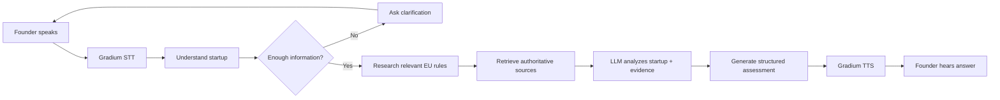
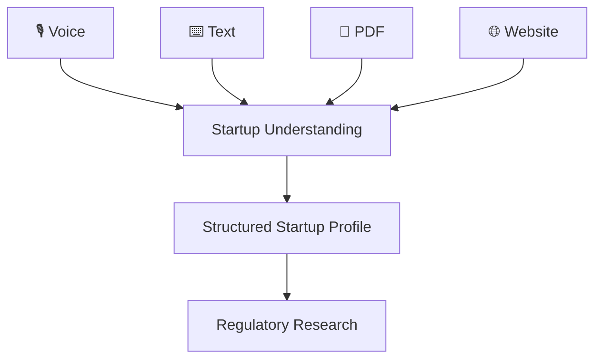
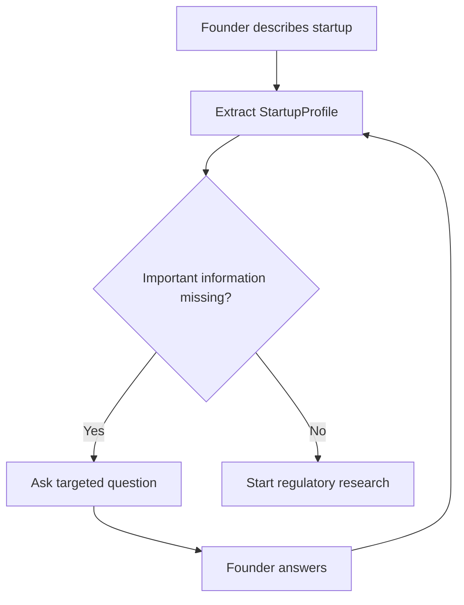
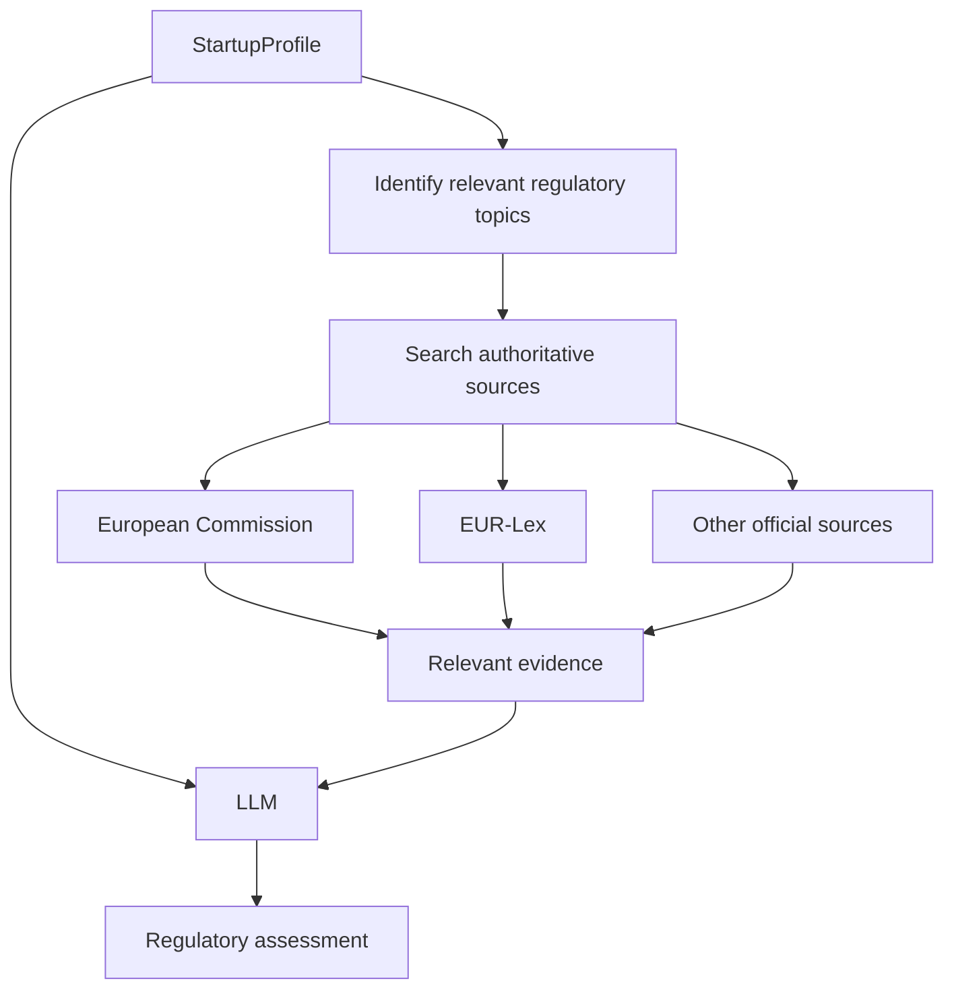
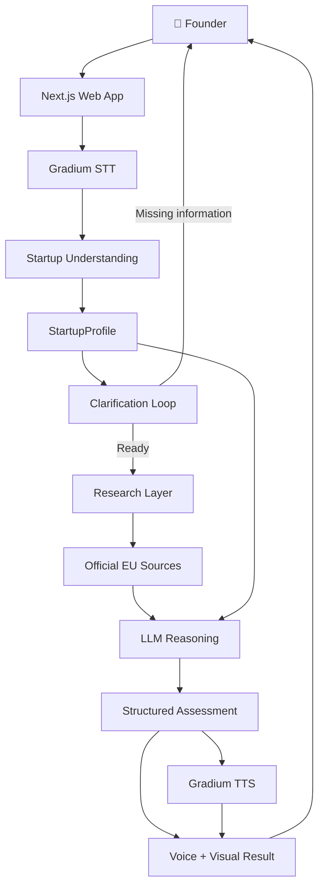
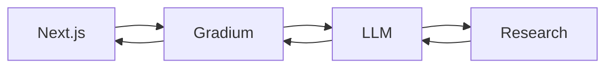
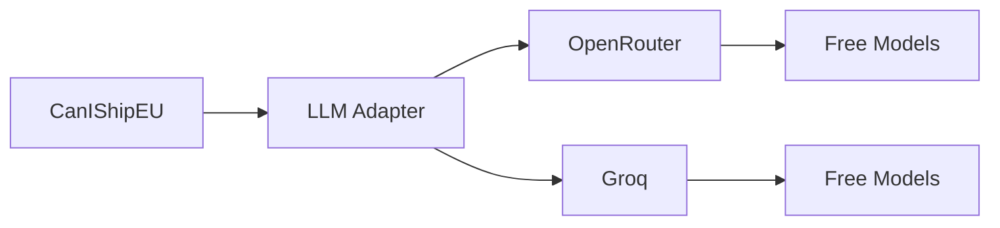
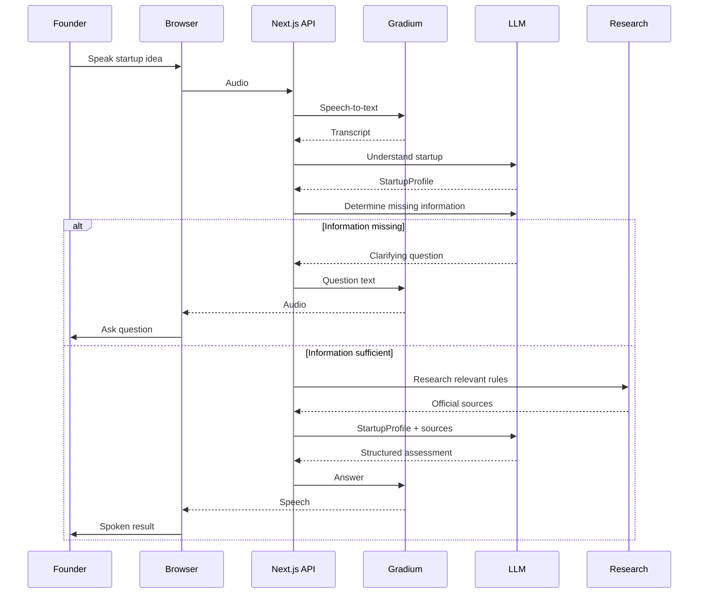
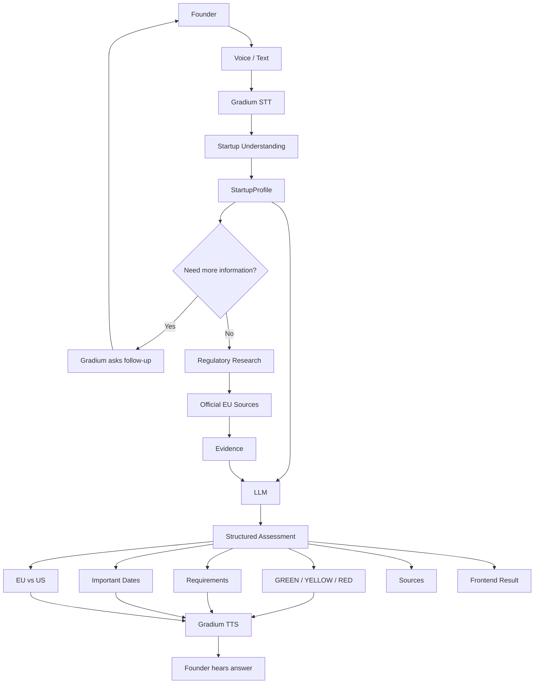

# CanIShipEU 🇪🇺

> **Can you ship this in Europe? Just ask.**

CanIShipEU is a **voice-first AI prototype for European startup founders**.

A founder describes their startup idea by speaking naturally. CanIShipEU understands what the product does, identifies the parts of the product that may matter from a regulatory perspective, researches relevant and current EU rules from authoritative sources, and explains what the founder may need to consider before launching.

The founder can also ask follow-up questions such as:

> “What if I launch in the US instead?”

The goal is not to replace a lawyer or provide guaranteed legal advice.

The goal is to make the first step much easier:

> **Before I spend months building this, can I actually ship it in Europe, and what do I need to know?**

---

# The Problem

European startup founders often have a very simple question:

> **“Can I launch this in the EU?”**

Getting a useful answer can be surprisingly difficult.

The information founders need may be spread across:

* European Commission websites
* EUR-Lex
* different regulations
* regulatory guidance
* implementation timelines
* national requirements
* technical documentation
* legal interpretations

Most of this information is not written for a founder who is simply trying to understand whether their product idea creates a problem.

A founder thinks about their product like this:

> “We're building an AI system that ranks job candidates.”

Regulatory material may describe the same situation using concepts such as:

> AI systems used in employment, candidate evaluation, risk classification, provider/deployer obligations, human oversight, documentation, etc.

There is a gap between **how a founder describes a product** and **how regulations describe the same product**.

CanIShipEU tries to bridge that gap.

---

# What We Are Building

The product is essentially a conversational research agent.

The founder talks to it.

The system first tries to understand the startup rather than immediately trying to answer whether it is legal.

For example:

> **Founder:**
> “I'm building an AI recruiter that reads CVs, scores candidates and recommends who should get interviewed. We're planning to launch in Germany next year.”

The system understands the idea and may respond:

> **CanIShipEU:**
> “Does the AI make the final hiring decision, or does a human make the final decision?”

The founder answers:

> “A human makes the final decision.”

Now the system has much more useful information.

It can research the relevant rules and produce an explanation.

For example:

> 🟡 **Potential regulatory requirements**
>
> Your product may fall into an area where EU AI requirements are significant because it is being used in employment and candidate assessment.
>
> Here's what you should investigate before launch...

The important difference is that the system should explain **why** it reached its conclusion and provide the sources behind the answer.

---

# The Core User Flow

The entire product can be understood as:



The system therefore follows this basic pattern:

**Listen → Understand → Clarify → Research → Reason → Explain**

---

# Why Voice Is Important

Voice is not just an input method for this project.

It is one of the main reasons we are building the product.

The project is also intended to demonstrate what can be built with **Gradium voice AI**.

Instead of giving the founder a large form asking:

* What industry are you in?
* What does your AI do?
* Who are the users?
* Do you process personal data?
* Where are you launching?
* When are you launching?

we want the founder to simply talk.

The agent can extract this information naturally during the conversation.

For example:

```text
Founder:
"I'm building an AI tool for hospitals
that analyzes medical images."

Agent:
"Is the AI actually helping diagnose patients,
or is it mainly organizing the images?"

Founder:
"It helps doctors identify possible tumors."

Agent:
"Got it. Which EU countries are you
planning to launch in?"

Founder:
"Germany and France."

Agent:
"Okay, I'll check the relevant requirements."
```

This makes the experience feel like an actual agent rather than a form connected to an LLM.

It also gives us an opportunity to demonstrate:

* Gradium speech-to-text
* Gradium text-to-speech
* natural conversation
* multilingual interaction
* low-latency responses
* interruption and turn-taking
* potentially voice cloning

---

# Input: Voice First, But Not Voice Only

The first version should primarily use voice.

However, the architecture should not make voice the only possible input.

Eventually the user could provide:

```text
🎙️ Voice
⌨️ Text
📄 Product brief / PDF
🌐 Website URL
📑 Pitch deck
```

All of these should eventually be converted into the same internal representation of the startup.



For the initial prototype, **voice + text fallback is enough**.

PDF and website analysis can be added later without changing the core regulatory system.

---

# Understanding the Startup

This is a key part of the architecture.

We should not take the founder's sentence and immediately ask:

> “Is this legal in Europe?”

Instead, the system first converts the conversation into a structured description of the startup.

For example, the founder says:

> “We're building an AI recruiter that reads CVs, scores candidates and recommends who should get interviewed. A human makes the final decision. We're launching in Germany.”

The understanding layer could produce:

```json
{
  "product": "AI recruitment platform",
  "domain": "employment",
  "ai_capability": "candidate scoring and recommendation",
  "users": [
    "employers",
    "recruiters"
  ],
  "affected_people": [
    "job applicants"
  ],
  "decision_role": "recommendation",
  "human_involvement": true,
  "uses_personal_data": true,
  "uses_sensitive_data": "unknown",
  "uses_biometrics": false,
  "geography": [
    "Germany",
    "European Union"
  ],
  "planned_launch": "2027"
}
```

This becomes the central object that the rest of the application works with.

We can call it:

```text
StartupProfile
```

The same `StartupProfile` can eventually be created from voice, text, PDF, or a website.

---

# Clarifying Questions

A founder will often give us incomplete information.

We should not force them to write a perfect prompt.

Instead, the agent should identify missing information that could materially change the assessment.

For example:



Examples of useful questions:

* Does the AI make the final decision?
* Does a human review the AI's output?
* Are you processing personal data?
* Are you processing sensitive data?
* Are you using biometric information?
* Who is affected by the system?
* Which countries are you launching in?
* When are you planning to launch?

The agent should ask only questions that are relevant to the particular product.

---

# Regulatory Research

Once we understand the startup, the next step is research.

This is where the project differs from a simple chatbot.

The LLM should **not be treated as the source of truth for EU law**.

Instead, we use the startup profile to identify what topics and regulations may be relevant.

For example:

```text
StartupProfile
      ↓
Employment AI
      ↓
Candidate assessment
      ↓
EU AI Act
      ↓
Relevant provisions / guidance
      ↓
Official sources
      ↓
Evidence
      ↓
LLM reasoning
```

The research layer should prioritize authoritative sources such as:

* European Commission
* EUR-Lex
* official EU institutions
* relevant national authorities where appropriate

The model then receives both:

1. the structured description of the startup
2. the relevant evidence retrieved from those sources

It reasons over the evidence rather than relying only on what it remembers.

---

# Research and Reasoning Architecture



The LLM's role is therefore:

**Understand → classify → interpret evidence → explain**

rather than:

**Remember law → make a confident guess**

---

# What the System Actually Determines

The system is not simply looking for the word “legal.”

It tries to answer several practical founder questions:

* What regulations may apply?
* Why might they apply?
* What category or risk level might be relevant?
* What obligations may need to be investigated?
* Are there important implementation dates?
* What information is still uncertain?
* What should the founder check before launch?
* How does the situation compare with the US?

The output should communicate uncertainty where appropriate.

---

# GREEN / YELLOW / RED

For the prototype, we can use a simple visual classification:

| Result    | Meaning                                                                                         |
| --------- | ----------------------------------------------------------------------------------------------- |
| 🟢 GREEN  | No major regulatory obstacle identified from the researched information                         |
| 🟡 YELLOW | The product may be launchable, but meaningful regulatory/compliance requirements need attention |
| 🔴 RED    | A major restriction, prohibition, or serious regulatory issue appears relevant                  |

These labels are **orientation signals**, not legal conclusions.

For example, YELLOW should not mean:

> “You are illegal.”

It should mean something closer to:

> “You may be able to launch, but there are important requirements you need to investigate.”

Likewise, GREEN does not mean:

> “You are guaranteed to be compliant.”

---

# Structured Assessment

The reasoning layer should return structured data rather than an arbitrary paragraph.

For example:

```json
{
  "verdict": "YELLOW",
  "confidence": "medium",
  "summary": "The product may be deployable in the EU, but employment-related AI requirements may apply.",
  "relevant_regulations": [
    {
      "name": "EU AI Act",
      "reason": "The system evaluates or supports decisions about job candidates."
    }
  ],
  "requirements": [
    "Determine the applicable classification",
    "Review provider/deployer obligations",
    "Review human oversight requirements",
    "Review documentation and risk-management requirements"
  ],
  "important_dates": [],
  "eu_vs_us": {
    "eu": "Potentially significant regulatory requirements",
    "us": "Requirements vary by jurisdiction and use case"
  },
  "uncertainties": [
    "Exact classification depends on the final system functionality and deployment."
  ],
  "sources": []
}
```

The frontend then turns this structured response into the visual result.

---

# EU vs US

The EU vs US comparison is an important part of the product.

A founder may not only ask:

> “Can I ship this in Europe?”

They may immediately ask:

> “Would this be easier to launch in the US?”

The system should therefore compare the relevant considerations rather than making simplistic claims.

The comparison could look like:

```text
EU 🇪🇺

Relevant rules:
• ...
• ...

Main considerations:
• ...
• ...

Important dates:
• ...

US 🇺🇸

Relevant considerations:
• ...
• ...

Key difference:
• ...
```

The goal is to help founders understand **where the regulatory friction comes from**, not to argue that one region is universally better.

---

# End-to-End Architecture



---

# Technology Stack

The initial stack is intentionally simple.

| Layer          | Technology                         | Purpose                                     |
| -------------- | ---------------------------------- | ------------------------------------------- |
| Frontend       | Next.js                            | Web application and UI                      |
| Language       | TypeScript                         | Application language                        |
| Styling        | Tailwind CSS                       | UI styling                                  |
| UI components  | shadcn/ui                          | Reusable interface components               |
| Speech-to-text | Gradium                            | Convert founder speech into text            |
| Text-to-speech | Gradium                            | Convert agent responses into natural speech |
| Voice cloning  | Gradium                            | Optional voice-cloning demo feature         |
| LLM            | OpenRouter free models             | Startup understanding and reasoning         |
| LLM fallback   | Groq free tier                     | Alternative fast inference provider         |
| Research       | Official EU sources + search layer | Regulatory evidence                         |
| Backend        | Next.js API routes                 | Server-side orchestration                   |
| Database       | None initially                     | Keep prototype simple                       |
| Authentication | None initially                     | Not needed for demo                         |
| Payments       | None                               | Not needed                                  |
| Analytics      | None initially                     | Not needed                                  |
| Hosting        | Local first                        | Avoid unnecessary deployment costs          |
| Future hosting | Vercel or similar                  | Only when public deployment is needed       |

---

# Why We Are Keeping the Stack Simple

This is a prototype, not a production compliance platform.

We don't need to start with:

* a database
* authentication
* payment infrastructure
* vector databases
* complex agent frameworks
* distributed workers
* microservices
* elaborate observability
* a public API

The initial application can be:



This makes it much easier to build, debug, and demonstrate.

If the concept proves useful, we can add infrastructure later.

---

# LLM Provider Strategy

The LLM should be behind an adapter so that the application isn't tied to one provider.

Conceptually:



The application should call something like:

```typescript
const assessment = await llm.analyze({
  startupProfile,
  sources
});
```

The rest of the application shouldn't care which model is being used.

This allows us to experiment with different free models without rewriting the product.

---

# Cost Strategy

The goal is to build and demonstrate the prototype without creating an unexpected recurring bill.

The initial approach is therefore:

* use available Gradium free credits
* use free LLM inference
* minimize external search usage
* run locally while developing
* don't expose unlimited public API access

The product does **not** need to be publicly deployed for the first demo.

For the X video, we can run everything locally and record the experience.

If people want to test it afterwards, we can initially handle testing manually rather than opening an unrestricted public endpoint.

---

# Project Structure

```text
canishipeu/
│
├── app/
│   ├── page.tsx
│   │
│   └── api/
│       ├── transcribe/
│       │   └── route.ts
│       │
│       ├── understand/
│       │   └── route.ts
│       │
│       ├── search/
│       │   └── route.ts
│       │
│       ├── assess/
│       │   └── route.ts
│       │
│       └── speak/
│           └── route.ts
│
├── components/
│   ├── VoiceInterface.tsx
│   ├── Conversation.tsx
│   ├── VerdictCard.tsx
│   ├── Sources.tsx
│   ├── EUUSComparison.tsx
│   └── StartupProfile.tsx
│
├── lib/
│   ├── gradium.ts
│   ├── llm.ts
│   ├── search.ts
│   ├── regulations.ts
│   └── prompts.ts
│
├── data/
│   └── eu-sources.json
│
├── types/
│   └── startup.ts
│
├── public/
│
├── .env.local
├── package.json
├── tsconfig.json
└── README.md
```

---

# The Important Data Model

The most important object in the system is `StartupProfile`.

It represents what we know about the company and product.

```typescript
type StartupProfile = {
  product: string;

  domain?: string;

  aiCapability?: string;

  users?: string[];

  affectedPeople?: string[];

  decisionRole?:
    | "none"
    | "assistance"
    | "recommendation"
    | "decision"
    | "unknown";

  humanInvolvement?: boolean | "unknown";

  usesPersonalData?: boolean | "unknown";

  usesSensitiveData?: boolean | "unknown";

  usesBiometrics?: boolean | "unknown";

  geography?: string[];

  plannedLaunch?: string;

  additionalContext?: string;
};
```

Everything eventually revolves around this object.

Voice creates it.

Text creates it.

A future PDF parser creates it.

A future website analyzer creates it.

The research engine consumes it.

The assessment engine consumes it.

---

# API Flow

The backend can initially be implemented using Next.js API routes.

Conceptually:



---

# Regulatory Source Strategy

The research system should be designed around source quality.

The preferred hierarchy is:

```text
Official EU legislation
        ↓
Official EU guidance
        ↓
Official EU institutional information
        ↓
National government / regulator
        ↓
High-quality secondary sources
        ↓
General web content
```

The final answer should preferably cite the actual official sources that support the conclusion.

This is particularly important because regulations and implementation dates can change.

---

# Example Complete Conversation

```text
Founder:

"I'm building an AI recruiter.
It reads CVs, scores candidates and recommends
who should get interviewed.
Can I launch in Germany?"

                    ↓

CanIShipEU:

"Does the AI make the final hiring decision,
or does a human make the final decision?"

                    ↓

Founder:

"A human makes the final decision."

                    ↓

CanIShipEU:

"Got it. I'm checking the relevant EU requirements."

                    ↓

       ┌───────────────────────┐
       │ StartupProfile        │
       │                       │
       │ Employment AI         │
       │ Candidate scoring     │
       │ Human decision        │
       │ Germany               │
       └───────────┬───────────┘
                   │
                   ▼
          Regulatory research
                   │
                   ▼
          Official EU sources
                   │
                   ▼
             LLM reasoning
                   │
                   ▼

              🟡 YELLOW

                    ↓

CanIShipEU:

"You may be able to launch this in the EU,
but employment-related AI can bring significant
requirements.

The main things to investigate are..."

                    ↓

Founder:

"What about the US?"

                    ↓

CanIShipEU:

"In the US, the situation is more fragmented
and depends on the jurisdiction and use case..."
```

This is the core product experience.

---

# What Makes the Project Interesting

There are two problems being solved simultaneously.

### Founder problem

Regulatory information is difficult to translate into a simple product-level answer.

### Technology problem

Voice AI usually demonstrates conversation, while regulatory research usually happens through text-heavy interfaces.

CanIShipEU combines both:

```text
                 CANISHIPEU

      ┌──────────────────────────┐
      │                          │
      │      Voice AI            │
      │          +               │
      │   Startup understanding  │
      │          +               │
      │   Regulatory research    │
      │          +               │
      │    Evidence-based LLM    │
      │          +               │
      │     EU vs US context     │
      │                          │
      └──────────────────────────┘
```

The result is a product that is useful enough to understand immediately while also being a strong technical demonstration.

---

# What We Are NOT Building

The first version is not intended to be:

* a complete EU legal database
* a replacement for lawyers
* an automated compliance certification system
* a guaranteed legal-answer engine
* a production SaaS platform
* an enterprise compliance product

The first version is a **focused prototype that answers a very recognizable founder question**.

---

# Prototype Safety

The product should clearly communicate:

> **Prototype / informational tool — not legal advice.**

The wording of the verdict should also avoid absolute claims.

Instead of:

> “You are legally allowed to launch.”

Prefer:

> “Based on the sources reviewed, no major restriction was identified, but you should verify the requirements applicable to your specific deployment.”

Instead of:

> “This is illegal.”

Prefer:

> “This appears to raise a major restriction or prohibition that should be reviewed before launch.”

The system should be useful without pretending to have legal authority.

---

# Development Approach

We should build the project incrementally.

The first thing to prove is simply:

```text
🎙️ Voice
   ↓
Gradium STT
   ↓
Text
   ↓
Gradium TTS
   ↓
🔊 Voice
```

Once that works, add the LLM:

```text
🎙️
 ↓
Gradium STT
 ↓
LLM
 ↓
Gradium TTS
 ↓
🔊
```

Then make the LLM understand startups:

```text
Voice
 ↓
Transcript
 ↓
StartupProfile
```

Then add the clarification loop.

Then add regulatory research.

Then add evidence-backed reasoning.

Then add the structured verdict.

Then polish the voice experience.

Finally add optional features such as interruption, multilingual interaction, and voice cloning.

This order keeps us from spending time on advanced features before proving that the core product works.

---

# MVP

The first usable version should allow someone to:

* speak their startup idea
* have the system understand it
* answer a clarification question
* research relevant EU information
* receive a GREEN/YELLOW/RED-style result
* hear the answer through Gradium
* see the reasoning and sources
* ask a follow-up question
* compare the EU with the US

That is enough to demonstrate the entire concept.

---

# Future Extensions

Once the core experience works, the same architecture can support much more.

A founder could eventually upload a pitch deck:

```text
Pitch Deck
    ↓
Extract product information
    ↓
StartupProfile
    ↓
Regulatory research
```

Or provide their website:

```text
Website URL
    ↓
Understand product
    ↓
StartupProfile
    ↓
Regulatory research
```

Or ask:

> “Tell me if anything important changes before I launch.”

That could eventually become a regulatory monitoring product.

But those are future possibilities.

The prototype should first prove the central interaction.

---

# The Core Architecture in One Diagram



---

# Final Product Definition

CanIShipEU is a **voice-first regulatory research assistant for startup founders**.

A founder doesn't need to know which regulation applies.

They don't need to understand legal terminology.

They don't need to fill out a long questionnaire.

They simply explain:

> **“Here's what I'm building.”**

CanIShipEU then:

**listens → understands the product → asks what it needs to know → researches authoritative EU sources → reasons over the evidence → explains the regulatory situation → compares with the US → speaks the answer back.**

The central idea is simple:

> **Before you build it, ask: Can I ship this in Europe?**
